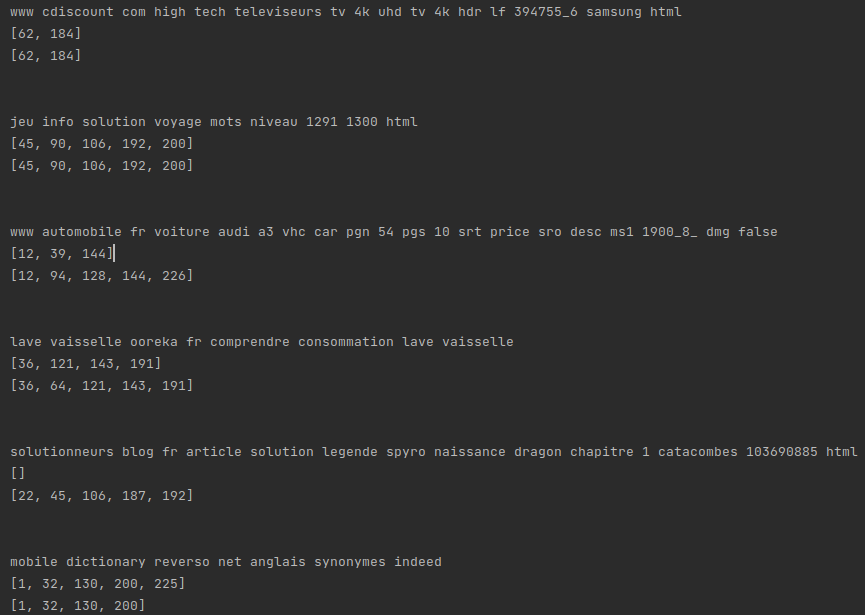
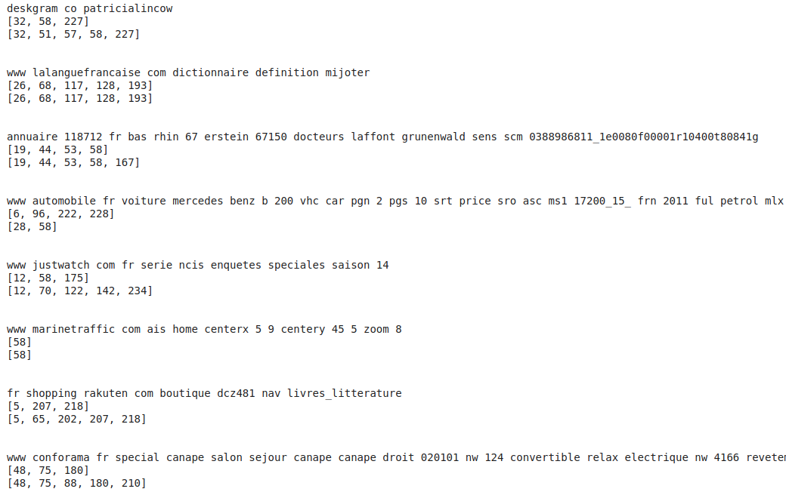

# URL-Multilabel-Classification

## About

The goal of the challenge is to produce a multi-label classifier capable of inferring the categories of a url.

## Dataset

Parquet files, ~ 70,000 urls. Zipped files can be downloaded
at [data](https://drive.google.com/file/d/1q4EYndbegewI6wc59CiJSY6t9YitnHD4/view?usp=sharing) (3.6MB).

Dataset in parquet format comprising the following columns:

- **Url**: url of a page.
- **Day**: the day of the month.
- **Target**: the list of classes associated with the url ← what we want to predict.

## Prerequisite

Create virtual environment and install requirements for the project:

```
cd path/of/project
python -m venv venv
source venv/bin/activate
pip install -r requirements.txt
```

## File structure

- ```preprocess.py```: Preprocess raw data from parquet files.
- ```util.py```: Get insights from preprocessed data, evaluate trained model, split data.
- ```LogisticRegression.py```: Combine tf_idf, OneVsRestClassifier and LogisticRegression to train a model.
- ```lstm.ipynb```: Note book for testing LSTM and Dense network for multilabel classification.
- ```TFcamemBert.ipynb```: Note book for training and testing camemBert model sur google colab as the training Bert base
  model is expensive.
- ```TF*.py```: Code to produce camemBert model for multilabel classification in TensorFlow.
- ```PT*.py```: Code to produce camemBert model for multilabel classification in PyTorch.
- ```*_inference.py```: Model inference.

## To perform a training
```python LogisticRegression.py```

or

```python TFcamemBert.py.py```

or

```python PTcamemBert.py```

## To perform an inference
```python LogisticRegression_inference.py```

or

```python TFcamemBert_inference.py```

or

```python PTcamemBert_inference.py```

## First steps to reduce the complexity of the problem

1. Extract raw url into more meaningful words.

```python
def extract_url(url):
    """
    Extract URL into meaningful words
    :param url: The web URL
    :return: The extracted string
    """
    parsed_unquoted = urlparse(unquote_plus(url))
    text = parsed_unquoted.netloc + ' ' + parsed_unquoted.path + ' ' + parsed_unquoted.params + ' ' + parsed_unquoted.query
    text = text.replace('\n', ' ').lower()
    text = REPLACE_IP_ADDRESS.sub(' ', text)
    text = REPLACE_BY_SPACE_RE.sub(' ', text)
    text = BAD_SYMBOLS_RE.sub(' ', text)
    text = ' '.join([w for w in text.split() if w not in STOPWORDS])
    return text
```

Example of extracting url:

```python
url = 'https://www.fnac.com/Apple-iPhone-12-mini-5-4-64-Go-Double-SIM-5G-Blanc/a13745982/w-4'
Extracted
url: 'www fnac com apple iphone 12 mini 5 4 64 go double sim 5g blanc a13745982 w 4'
```

2. As there are more than 1900 different classes, the second step is to reduce the number of classes in the dataset. By
   choosing a threshold value equal to 200, we will group all classes that appears less than this threshold into the
   group "Other". After the grouping process, only 238 classes remain. Note that this threshold is a hyper-parameter and
   can be changed depends on our strategy.

```python
def group_less_occur_label(target, counter, threshold=200):
    """
    Group labels that occur less than threshold times
    :param target: Target labels of an URL
    :param counter: Label counter
    :param threshold: Threshold
    :return: New target
    """
    original_len = len(target)
    new_target = list(label for label in target if counter[label] > threshold)
    if len(new_target) < original_len:
        new_target.append('Other')

    return new_target
```

## Model evaluation

Note:

- Scores of CamemBert Pytorch are expected to be the same as CamemBert TensorFlow, as pretrained weights are the same (
  from HuggingFace).

1. On validation set

| Model | Accuracy | Hamming loss | F1 score macro | F1 score micro | F1 score weighted |
| :------------- |:-------------:|:-------------:|:-------------:|:-------------:| :-----:|
|LogisticRegression| 0.283 | 0.008 | 0.618 | 0.713 | 0.698 |
|Dense | 0.094 | 0.014 | 0.102 | 0.392 | 0.631 |
| LSTM | 0.064 | 0.016 | 0.002 | 0.218 | 0.703 |
| CamemBert TensorFlow | 0.139 | 0.010 | 0.240 | 0.610 | 0.498 |
| CamemBert Pytorch |

2. On test set

| Model | Accuracy | Hamming loss | F1 score macro | F1 score micro | F1 score weighted |
| :------------- |:-------------:|:-------------:|:-------------:|:-------------:| :-----:|
|LogisticRegression| 0.287 | 0.008 | 0.635 | 0.727 | 0.712 |
|Dense | 0.097 | 0.014 | 0.102 | 0.395 | 0.641 |
| LSTM | 0.067 | 0.016 | 0.002 | 0.220 | 0.707 |
| CamemBert TensorFlow | 0.142 | 0.010 | 0.244 | 0.617 | 0.505 |
| CamemBert Pytorch |

## Examples

Note:

- First row is predicted labels.
- Second row is true labels

1. Examples of LogisticRegression model
   

2. Examples of CamemBert model
   

## Conclusion

- ```LogisticRegression``` seems to work best for this situation: highest score, fast training time compare to others
  models.
- ```CamemBert``` performs worse than ```LogisticRegression```. The problem may come from the fact that words extracted
  from url may not correlate to each others and contains many random words (like abbreviation of words, code, number,
  domain name). Another problem may come from over fitting, as the model (has more than 110 million parameters) was
  trained on 3 epochs.
- ```Dense``` and ```LSTM``` perform not really good.
- Some articles have mentioned that ```FlauBert``` is better than ```CamemBert``` ?! => To be tested